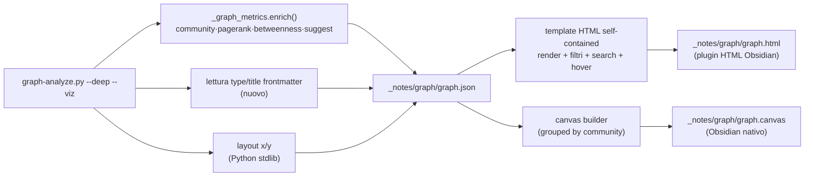

# Visualizzazione del grafo wiki — Specifiche & Piano di lavoro

Porting della visualizzazione del grafo dall'app di riferimento
(`/Users/S.Parodi/Development/Varie/llm_wiki`) verso due output fruibili in
Obsidian: **HTML interattivo** (primario) e **Canvas** (complementare).
Documento di progetto — nessuna implementazione ancora.

---

## 1. Contesto e obiettivi

`graph-analyze --deep` calcola già (in `_graph_metrics.py`, stdlib puro) tutto il
modello dati necessario: community (Louvain), PageRank, betweenness, componenti
connesse, link suggeriti. **Manca solo il livello di rendering.** L'obiettivo è
produrre artefatti visuali esplorabili dentro Obsidian, con particolare enfasi
sulle **funzionalità di filtro** dell'app di riferimento.

**Obiettivi**
- Riusare i dati già prodotti da `_graph_metrics.enrich()` — niente ricalcolo, niente LLM.
- HTML interattivo con i filtri runtime del riferimento (il caso d'uso principale).
- Canvas come snapshot statico, editabile, con card-file native.
- Restare self-contained e in-stack (Python stdlib lato dati; HTML senza dipendenze remote).

**Vincoli (NOTA-1: complessità solo se ne vale la pena)**
- Scala attuale: ~200–326 nodi (la vault più grande). Niente ottimizzazioni di scala.
- Output **fuori da `wiki/`** (entrerebbe nell'indice QMD): tutto in `_notes/graph/`.
- HTML **self-contained** (dati + JS + CSS inline): molti viewer Obsidian bloccano script/CDN remoti (sandbox/CSP).
- Niente nuove dipendenze runtime per la pipeline Python (resta stdlib).

---

## 2. Cosa portiamo dal riferimento

Stack originale: React + `sigma` (WebGL) + `graphology` + `forceatlas2` + `louvain`.
Estraiamo **le feature**, non lo stack.

| Feature riferimento | Portiamo? | Dove |
|---|---|---|
| Layout force-directed | ✅ | HTML (baked o client-side); Canvas (grouped) |
| Colore per **tipo** / **community** (toggle) | ✅ | HTML toggle; Canvas: una colorazione per file |
| Dimensione nodo ∝ grado | ✅ | entrambi |
| Spessore/colore arco ∝ peso | ✅ HTML / ⚠️ Canvas (archi senza spessore) | — |
| **Filtri** (`graph-filters.ts`, 89 righe) | ✅ | HTML runtime; Canvas a generazione |
| Search → highlight | ✅ | HTML |
| Hover → evidenzia vicini, attenua resto | ✅ | HTML |
| Click nodo → apri pagina | ⚠️ (vedi §5.4) | HTML caveat / Canvas nativo |
| Insights: surprising / gaps / bridge | ✅ (dati già nostri) | HTML pannello (fase 2+) |
| "Research this gap" (deep-research runtime) | ❌ fuori scope | — |

La logica dei filtri è banale e si porta verbatim (set/booleani/soglia):

```
hiddenTypes · hiddenNodeIds · hideStructural(default ON) · hideIsolated · maxLinks
+ un arco è visibile solo se entrambi gli estremi lo sono.
```

---

## 3. Contratto dati condiviso — `graph.json`

Sorgente unica per HTML e Canvas, emessa da `graph-analyze`. Riusa
`_graph_metrics.enrich()`; va aggiunta solo la lettura di `type`/`title` dal
frontmatter dei nodi (oggi `graph-analyze` legge solo i wikilink).

```jsonc
{
  "meta": { "generated": "2026-06-15", "vault": "data-platform",
            "nodes": 312, "edges": 1041, "modularity": 0.41 },
  "nodes": [
    {
      "id": "duckdb",                 // stem (chiave)
      "label": "DuckDB",              // title da frontmatter, fallback stem
      "type": "entity",               // dedotto dalla cartella wiki/<tipo>s/ o dal frontmatter
      "path": "wiki/entities/duckdb.md",
      "linkCount": 27,                // in+out (già calcolato)
      "community": 0,                 // id Louvain (già calcolato)
      "pagerank": 0.018,              // già calcolato
      "betweenness": 12.4,            // già calcolato (→ pagine-ponte)
      "x": 134.2, "y": -88.1          // posizione (vedi §6: baked o client-side)
    }
  ],
  "edges": [ { "source": "duckdb", "target": "iceberg", "weight": 3 } ],
                                       // weight = molteplicità dei wikilink (non
                                       // semantico: il riferimento usa relevance da
                                       // embedding, noi la conta — sufficiente per v1)
  "communities": [ { "id": 0, "size": 41, "topNodes": ["duckdb","iceberg","parquet"] } ],
  "insights": {
    "bridges":   [ { "id": "duckdb", "betweenness": 12.4 } ],     // top betweenness
    "suggested": [ { "a": "x", "b": "y", "common": ["z"], "score": 1.2 } ], // link mancanti
    "isolated":  [ "nodo-orfano" ]                                // da componenti/orfani
  }
}
```

**Tipo nodo**: dedotto deterministicamente dalla cartella
(`wiki/entities/`→`entity`, `concepts/`→`concept`, `sources/`→`source`,
`queries/`→`query`, `synthesis/`→`synthesis`), con fallback al campo `type` del
frontmatter. **Strutturali** (`index/overview/log/schema/purpose`) marcati come nel
riferimento.

---

## 4. Architettura



Tutto lato Python resta stdlib. L'HTML è un file statico autoportante.

---

## 5. PRIMARIO — HTML interattivo

### 5.0 Vincolo del viewer: `nuthrash/obsidian-html-plugin` (CONFERMATO)

Il plugin HTML usato (HTML Reader) ha 5 **modalità operative** con capacità diverse:

| Modalità | Immagini | Stili (CSS) | **Scripting (JS)** | CSP/Sanitize |
|---|---|---|---|---|
| Text | No | No | No | sì |
| High Restricted | sì | parziale | No | sì |
| **Balance** (default) | sì | sì | **No** | sì |
| Low Restricted | sì | sì | **No** — `<script>` ed esterni *non* eseguibili | no |
| **Unrestricted** | sì | sì | **Sì** — solo `<script>` inline; esterni forse no | no |

**Conseguenza forte**: il JavaScript inline **gira solo in modalità Unrestricted**.
Nelle modalità sicure (Balance default, High/Low Restricted) **nessun filtro/hover/search
interattivo è possibile** — passa solo HTML+CSS (+SVG/immagini). L'autore del plugin
sconsiglia Unrestricted ("very dangerous, may crash Obsidian"; "JS complesso ha meno
probabilità di funzionare; va riscritto per la piattaforma Obsidian"; gli script
**esterni** potrebbero comunque non caricarsi → **tutto deve essere inline**).

**Riletture indotte**:
- L'HTML **interattivo** (filtri runtime) richiede che l'utente imposti **Unrestricted mode**. È accettabile solo perché il file è **auto-generato e fidato** (non contenuto web esterno), ma resta fragile e non garantito.
- Per massimizzare le probabilità che funzioni in Unrestricted: **JS minimale, tutto inline, niente librerie pesanti** → la **Variante A** (vanilla, Canvas-2D) è nettamente preferibile alla B (sigma/WebGL, che ha alte probabilità di non girare nel plugin).
- **Modalità sicure** (Balance): è possibile solo un **SVG statico** (nodi/archi/colori/etichette, layout e filtri *cotti* alla generazione) — niente interazione. Di fatto equivale, come interattività, al Canvas, che però in Obsidian è nativamente pan/zoom/click-to-open/editabile.
- **Piena fedeltà garantita**: aprire lo **stesso `graph.html` in un browser esterno** (tutto il JS funziona senza vincoli). Resta l'opzione più affidabile per l'esplorazione filtrata completa.

### 5.1 Feature set v1
- Render del grafo (nodi colorati, archi pesati), **pan + zoom**.
- **Colore**: toggle **tipo** ↔ **community** (palette fissa, come il riferimento).
- **Dimensione nodo ∝ linkCount**; **arco ∝ weight**.
- **Pannello filtri** (port di `graph-filters.ts`):
  1. *Hide structural* (default ON)
  2. *Hide isolated* (linkCount ≤ 0)
  3. *Max links* (nascondi nodi sopra soglia → nasconde gli hub)
  4. *Per-type* (checkbox per tipo, con conteggi)
  5. *Hide singolo nodo* + **Reset**
  6. Contatore "X/Y nodi · N nascosti".
- **Search** → evidenzia i nodi che matchano (substring sul label).
- **Hover** → evidenzia il nodo e i vicini, attenua il resto.
- **Legenda** (tipi/community) collassabile.

### 5.2 Fuori scope v1
Insights laterali (surprising/gaps/bridge: dati già nel json → fase successiva);
azione research-gap (runtime, specifica dell'app); relayout animato (vedi §6).

### 5.3 Renderer — Variante A (decisa, alla luce del §5.0)
- **Variante A — baked layout + renderer vanilla (SCELTA).** Posizioni
  precalcolate in Python; l'HTML disegna su `<canvas>` 2D e gestisce
  pan/zoom/hover/filtri in JS puro (~300–400 righe). **Zero dipendenze, zero
  build, file piccolo, tutto inline** → unica con probabilità reali di girare
  sotto il plugin in Unrestricted mode (JS semplice). I filtri nascondono/ridisegnano
  su posizioni fisse (nessun reflow; restano "buchi" — accettabile).
- ~~Variante B — `sigma`+`graphology` bundlati~~: **scartata**. Bundle pesante con
  WebGL/worker ha alte probabilità di non funzionare nel plugin (e gli script
  esterni non si caricano). Resta solo un'opzione per l'uso in **browser esterno**.

### 5.4 Vincoli/caveat
- **Self-contained obbligatorio**: `graph.json` embeddato in `<script type="application/json">`, JS/CSS inline. Niente CDN né file esterni (il plugin non li carica).
- **Richiede Unrestricted mode** del plugin per l'interattività (vedi §5.0); il file è fidato perché auto-generato, ma l'esecuzione non è garantita → tenere il JS minimale.
- **Click → apri pagina**: improbabile dentro il plugin; tentativo via `obsidian://open?vault=<v>&file=<path>`, ma è proprio dove il **Canvas** è nativamente superiore. Per la navigazione ai file, preferire il Canvas.
- **Doppia destinazione**: lo stesso `graph.html` è anche apribile in **browser esterno** (interattività piena garantita), utile come via affidabile.
- Rigenerato a ogni run di `graph-analyze --viz`.

### 5.5 Variante statica per le modalità sicure (opzionale)
Per chi non vuole Unrestricted: emettere anche un **SVG statico** (o HTML con SVG inline)
che renderizza in Balance mode — nodi/archi/colori/etichette con layout e filtri *cotti*
alla generazione. Nessuna interazione. Valutare se vale, dato che il Canvas copre già
il caso "in-Obsidian statico ma navigabile" in modo migliore.

---

## 6. Layout (x/y)

- **HTML Variante A / Canvas**: layout **precalcolato in Python stdlib**. Due opzioni:
  - *Force-directed* (Fruchterman–Reingold, ~50 righe, deterministico con seed) — aspetto "organico" classico.
  - *Community-clustered* (ogni community in una regione, nodi disposti in cerchio/griglia interna) — **più leggibile su Canvas** e valorizza i cluster già calcolati. **Raccomandato per il Canvas.**
- **HTML Variante B**: layout client-side (`forceatlas2`), nessun x/y nel json.

---

## 7. COMPLEMENTARE — Canvas Obsidian

### 7.1 Formato e contenuto
- File [JSON Canvas](https://jsoncanvas.org) `.canvas` generato dallo stesso `graph.json` (skill `json-canvas` già presente).
- **Nodi** = nodi `text` con `[[wikilink]]` alla pagina (leggeri e cliccabili) — opzione: nodi `file` (card del file) per anteprima, più pesanti su 300 nodi.
- **Colore nodo** per **tipo** (preset/hex Canvas) — una sola colorazione per file (no toggle runtime).
- **Group** = una community Louvain (riquadro etichettato col top-node della community).
- **Edge** = wikilink (Canvas non ha spessore arco → peso non rappresentabile).
- **Dimensione** del nodo ∝ linkCount (via width/height del nodo).

### 7.2 Filtri → a generazione (non runtime)
Il Canvas è un documento statico: i filtri si applicano **prima** di scrivere il
file, riusando la stessa logica (`applyGraphFilters` portata in Python). Default =
`hide structural ON` (come il riferimento). Opzioni CLI per profili:
`--canvas-hide-isolated`, `--canvas-max-links N`, `--canvas-types entity,concept`.

### 7.3 Valore proprio del Canvas
Card-file native (**click → apre la pagina**, garantito), **editabile** (riorganizzi
a mano, aggiungi note), navigazione/zoom nativi. Caso d'uso: snapshot curabile di un
cluster o della struttura dei ponti — **non** esplorazione filtrata interattiva.

---

## 8. Piano di lavoro

| Fase | Stato | Deliverable | File toccati | Test/verifica |
|---|---|---|---|---|
| **0 — Contratto dati** | ✅ fatto | `graph.json` emesso da graph-analyze | `graph-analyze.py` (`--viz`), `_graph_emit.py`, lettura type/title, layout Python | schema json + determinismo (unittest) ✅ |
| **1 — HTML (primario)** | ✅ fatto | `graph.html` self-contained con filtri/search/hover | `_graph_html.py` (template + JS/CSS inline) | smoke-test + `node --check` ✅; **verifica nel plugin HTML/browser = step utente** |
| **2 — Canvas (complementare)** | ✅ fatto | `graph.canvas` grouped-by-community | `_graph_canvas.py` | validità JSON Canvas ✅; apertura in Obsidian = step utente |
| **3 — Integrazione & docs** | parziale | `--viz` unificato (json+html+canvas) ✅; schedulazione opzionale (da fare); doc ✅ | `graph-analyze.py`, `SKILL.md` | suite completa verde ✅ |

### Dettaglio fasi

**Fase 0 — Contratto dati (fondamenta, condivise).**
- Nuovo modulo `_graph_emit.py` (stdlib): da `nodes`, `edge_counts` + output di `enrich()` costruisce il dict `graph.json`.
- Aggiungere a `graph-analyze` la lettura di `type` (cartella + fallback frontmatter) e `label` (title) per nodo.
- Layout Python (force-directed *o* community-clustered) → `x/y`.
- Flag `graph-analyze --deep --viz` scrive `_notes/graph/graph.json` (e in fasi 1–2 anche html/canvas).
- Test: forma dello schema, presenza campi, determinismo del layout (seed fisso), grafo-giocattolo.

**Fase 1 — HTML (primario).**
- Template HTML che embedda il json e include renderer + pannello filtri (port di `graph-filters.ts`) + search + hover + toggle colore + legenda.
- Renderer: **Variante A** (vanilla, baked layout) salvo decisione §9.
- Output `_notes/graph/graph.html`.
- Verifica rendering offline (apri il file nel browser); **verifica in Obsidian col plugin dell'utente = step locale sul Mac** (qui non possiamo testarlo).

**Fase 2 — Canvas (complementare).**
- Builder `.canvas`: nodi `text` con `[[wikilink]]`, group per community, edge dai wikilink, colore per tipo, layout grouped, dimensione ∝ grado.
- Filtri a generazione (default hide-structural) con flag CLI.
- Output `_notes/graph/graph.canvas`; verifica apertura/leggibilità in Obsidian.

**Fase 3 — Integrazione & documentazione.**
- Flag unico `--viz` = json+html+canvas in `_notes/graph/`.
- Opzionale: lo **scheduler graph-analyze del plugin** (già esistente) può emettere anche la viz a ogni run.
- Aggiornare `SKILL.md` (graph-analyze), `README_UI.md`, e questo doc; suite di test verde.

---

## 9. Decisioni

1. ~~Quale plugin HTML~~ → **RISOLTO**: `nuthrash/obsidian-html-plugin` (HTML Reader). JS solo in Unrestricted mode (§5.0). Conseguenze già recepite.
2. ~~Renderer HTML~~ → **RISOLTO**: **Variante A** (vanilla inline). B scartata per il plugin.
3. ~~Strategia di fruizione~~ → **RISOLTO: (C) Entrambi.** Generiamo **HTML (Variante A) + Canvas**, dati condivisi. Fruizione: in Obsidian il **Canvas** (nativo: pan/zoom, click→apri, editabile); l'**HTML interattivo** nel **browser esterno** per l'esplorazione filtrata piena, e — a discrezione dell'utente — anche in Obsidian attivando Unrestricted mode. Entrambe le fasi (1 e 2) sono in scope.
4. ~~Layout~~ → **default: community-clustered** (leggibile su Canvas, valorizza i cluster). Force-directed resta opzione.
5. ~~Nodi Canvas~~ → **default: `text` + `[[wikilink]]`** (leggeri, cliccabili). `file`-card opzione futura.
6. ~~Posizione output~~ → **`_notes/graph/`** (fuori dall'indice QMD).

Nessuna decisione gating residua: la spec è eseguibile dalla Fase 0.

---

## 10. Rischi

- **Scripting del viewer (confermato, §5.0)**: il JS gira **solo in Unrestricted mode**, sconsigliata dall'autore e potenzialmente instabile. È il rischio principale e ridimensiona l'HTML interattivo *in-Obsidian* da "primario sicuro" a "opzionale fragile". Mitigazioni: JS minimale tutto inline (Variante A); Canvas come via nativa affidabile in-Obsidian; browser esterno per fedeltà piena.
- **Click→pagina dall'HTML** quasi certamente non funziona nel plugin → il **Canvas** è la via affidabile per la navigazione ai file.
- **Weight degli archi** = molteplicità wikilink, non semantico: meno informativo della "relevance" del riferimento (accettabile v1; arricchimento futuro via co-citazione/QMD).
- **Leggibilità Canvas** a 300 nodi: mitigata dal raggruppamento per community e dai filtri a generazione.
