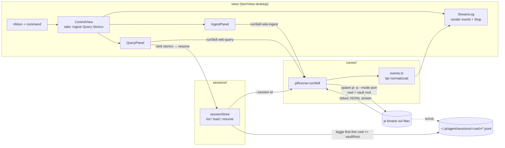

1. Confermare lo schema eventi — è il punto più probabile da ritoccare. Vuoi che lo verifichi subito? Lancio pi -p --mode json
  "ciao" nella vault root e confronto i nomi-campo con src/runner/events.ts (cercando il TODO confermare schema), così sappiamo se
  il parser dello streaming è già corretto o va adeguato.
  2. Abilitare il plugin in Obsidian → icona ribbon "cervello" → pannello con tab Query e Ingest.
  3. Query → streaming + [[wikilink]] + sessione nello storico; Ingest da _inbox/clippings; Settings → "Ricarica modelli".

# Plugin Obsidian: pannello di controllo llm-wiki (MVP)

## Context

La vault è una knowledge base LLM-driven le cui funzioni sono esposte come **Agent Skills** in `.claude/skills/` (`wiki-ingest`, `wiki-query`, `deep-research`, `wiki-lint`). Oggi si lanciano solo da CLI/chat. L'utente vuole un'**interfaccia dentro Obsidian** per lanciarle e gestirne lo storico senza uscire dall'editor.

Vincolo architetturale chiave (confermato leggendo i `SKILL.md`): le skill sono **agentic**, non pipeline deterministiche — l'LLM legge i prompt template, sostituisce variabili, decide e chiama gli script Python/QMD ("L'LLM gira nella tua sessione di agente; gli script Python si occupano di…"). Quindi il plugin **non reimplementa** la logica: **pilota l'agente `pi` in modalità headless** (`pi -p --skill <path> "<prompt>"`).

### Cosa ho verificato in questo container

- **I plugin esistenti spediscono solo build artifact** (`main.js` + `manifest.json` + `styles.css` + `data.json`), nessun sorgente TS → il nuovo plugin è un progetto TypeScript fresco. Riferimenti di manifest: `terminal` (`minAppVersion: 1.4.11`), `omnisearch` (`1.7.2`).
- **`.obsidian/plugins/` è versionato in git** (non ignorato); `node_modules/` è già coperto da `.gitignore` generico.
- **Node 22 + npm + registry npm raggiungibili** in questo container → posso `npm install` e `npm run build`, produrre il `main.js` bundleato e committarlo (il plugin sarà attivabile sul Mac senza build manuale).
- **`pi` e `~/.pi/agent/sessions/` NON esistono in questo container** (sono sulla macchina dell'utente). Conseguenza importante: **qui posso solo verificare che il plugin compili**; la verifica runtime (spawn di `pi`, streaming, storico, UI Obsidian) è uno **step locale dell'utente sul Mac**.

Decisioni già concordate (dalla bozza): UI = pannello laterale `ItemView` (non modale); output = streaming live via `pi --mode json`; runner = solo `pi`; scope v1 = ribbon + pannello con **Ingest** e **Query** + **storico** con resume. DeepResearch, Lint+`--fix`, schedulazione → iterazione 2 (struttura predisposta).

## Architettura

Tre strati: **runner** (spawn pi + parse stream) → **sessions** (lettura JSONL storico) → **UI** (ribbon + ItemView). Plugin TypeScript, bundle esbuild, `isDesktopOnly: true` (usa `child_process`).



## Struttura file (nuovo: `.obsidian/plugins/llm-wiki-control/`)

```
manifest.json        # id "llm-wiki-control", isDesktopOnly:true, minAppVersion "1.5.0"
package.json         # devDeps: obsidian, esbuild, typescript, @types/node; script build/dev
esbuild.config.mjs   # bundle src/main.ts -> main.js (external: obsidian, electron, node builtins)
tsconfig.json
styles.css
main.js              # COMMITTATO (output del build in questo container)
src/
  main.ts            # Plugin: loadSettings, addRibbonIcon, registerView, addCommand, SettingTab
  settings.ts        # LlmWikiSettings + DEFAULT_SETTINGS + SettingTab
  runner/piRunner.ts # spawn pi -p --mode json; parse stdout; onEvent callback; AbortSignal->kill
  runner/events.ts   # tipi eventi: {kind: text|thinking|toolCall|result|error, ...}
  sessions/sessionStore.ts  # scan ~/.pi/agent/sessions, match cwd==vaultRoot, list/load/resume
  view/ControlView.ts # ItemView VIEW_TYPE="llm-wiki-control", 3 tab
  view/IngestPanel.ts
  view/QueryPanel.ts
  view/StreamLog.ts
```

## Componenti — dettaglio implementativo

### 1. `runner/piRunner.ts` (cuore)
- `vaultRoot = (app.vault.adapter as FileSystemAdapter).getBasePath()`.
- `runSkill({ skill, prompt, sessionId?, continueLast?, signal, onEvent })`:
  - Args: `pi -p --mode json` + (`--session <id>` | `--continue`) + `--skill <vaultRoot>/.claude/skills/<skill>` + `"<prompt>"`.
  - `child_process.spawn(piPath, args, { cwd: vaultRoot, env })` — `cwd = vaultRoot` così pi vede `CLAUDE.md`/skills e scrive la sessione nella cartella giusta.
  - **PATH macOS**: Obsidian GUI ha PATH ridotto. `env = { ...process.env, PATH: process.env.PATH + ":/opt/homebrew/bin:/usr/local/bin" }`; `piPath` default `"pi"`, override assoluto da settings.
  - Stdout via `readline.createInterface`, `JSON.parse` per riga (try/catch: riga non-JSON → ignora), normalizza in `events.ts`, chiama `onEvent`. Stderr accumulato → emesso come evento `error` se exit code ≠ 0.
  - `signal` (AbortSignal) → `child.kill("SIGTERM")`.
- **Parser tollerante** (schema `--mode json` non confermabile qui): switch su `type`/`message.role`; campi sconosciuti ignorati. Step locale n.1 dell'utente: lanciare `pi -p --mode json "ciao"` sul Mac e, se i nomi-campo differiscono, ritoccare `events.ts` (commento `// TODO confermare schema` nel file).

### 2. `sessions/sessionStore.ts` (storico, **niente DB custom**)
- Cartella base: `path.join(os.homedir(), ".pi/agent/sessions")`.
- **Niente path hardcoded e niente reverse-engineering della sanitizzazione**: scorri le sottocartelle, leggi la **prima riga** di ogni `.jsonl` (`{type:"session", cwd, id, timestamp}`) e tieni solo quelle con `cwd === vaultRoot`. Robusto a qualunque regola di sanitizzazione di pi. (La cartella osservata `--Users-S.Parodi-Vaults-vault-template--` resta solo come esempio, non viene codificata.)
- `listSessions()` → `{ id, file, createdAt, firstUserText, skillHint }`: `createdAt` dal nome file / dal campo `timestamp`; `firstUserText` dal primo `message` con `role:"user"` (`content[0].text`); `skillHint` da un **marker nel prompt** (vedi sotto).
- `loadSession(id)` → array di messaggi parse per re-render nello StreamLog.
- `resume(id)` → ritorna l'id da passare a `runSkill({ sessionId })`.

### 3. `view/ControlView.ts` + panels
- `ItemView` con `VIEW_TYPE = "llm-wiki-control"`, `getIcon`/`getDisplayText`. In `main.ts`: `registerView`, `addRibbonIcon("brain-circuit", …, activateView)`, `addCommand({ id:"open-llm-wiki", callback: activateView })`. `activateView` usa `workspace.getRightLeaf(false).setViewType(...)` (pattern standard Obsidian).
- Tre tab (semplici bottoni che mostrano/nascondono `<div>`): **Ingest**, **Query**, **Storico**.
- **IngestPanel**: selettore file/cartella su `app.vault.getFiles()` filtrati per `defaultIngestDir` (default `_inbox/clippings`); bottone "Ingerisci" → `runSkill({ skill:"wiki-ingest", prompt:"[llm-wiki:ingest] Ingerisci <path> nella wiki" })`. **Avviso costo token se >5 file** (regola da `CLAUDE.md`) con conferma prima di procedere.
- **QueryPanel**: textarea + "Cerca" → `runSkill({ skill:"wiki-query", prompt:"[llm-wiki:query] " + testo })`. Sotto, lista storico (da `sessionStore`, filtrata per marker) → click carica la sessione nello StreamLog e abilita follow-up via `--session <id>`.
- **StreamLog**: componente riusato; render incrementale (testo append, `thinking` collassabile e gated da `settings.showThinking`, `toolCall` come riga compatta, `error` evidenziato), bottone **Stop** → abort del run corrente.
- **Marker prompt** `[llm-wiki:<skill>]`: prefisso riconoscibile → `skillHint` e filtro dello storico per tab. È benigno per l'agente (testo libero).

### 4. `settings.ts`
- Campi: `piPath` (default `"pi"`), `provider`, `model`, `defaultIngestDir` (`"_inbox/clippings"`), `showThinking` (bool). Predisporre (non implementare) `lintScheduleEnabled`/`lintIntervalMinutes`.
- `SettingTab`: dropdown provider/model popolato da `pi --list-models` (spawn una tantum, parse output, bottone "Ricarica modelli"). Se `provider`/`model` valorizzati → aggiungere `--provider`/`--model` agli args di `runSkill`.

## File esistenti rilevanti (sola lettura, non modificare)
- `.claude/skills/{wiki-ingest,wiki-query,deep-research,wiki-lint}/SKILL.md` — contratti invocati.
- `CLAUDE.md` — regole (conferma operazioni distruttive; **avviso costo batch >5 file**): replicare gli avvisi nella UI.
- Plugin esistenti (`terminal`, `omnisearch`) — riferimento per forma `manifest.json`.

## Iterazione 2 (fuori scope v1, struttura predisposta)
- **DeepResearch panel**: come Query ma `skill:"deep-research"` + toggle auto-ingest.
- **Lint panel**: bottone + checkbox `--fix` → prompt `"[llm-wiki:lint] Audita la wiki" (+ " con --fix")`.
- **Schedulazione lint**: `registerInterval` + cadenza da settings.

## Ordine di implementazione
1. Scaffold progetto (`manifest.json`, `package.json`, `tsconfig.json`, `esbuild.config.mjs`, `styles.css`) + `npm install`.
2. `runner/events.ts` + `runner/piRunner.ts` (parser tollerante).
3. `sessions/sessionStore.ts` (match per `cwd`).
4. `settings.ts`.
5. `view/StreamLog.ts` → `view/ControlView.ts` → `IngestPanel`/`QueryPanel`.
6. `src/main.ts` (wiring: settings, ribbon, view, command).
7. `npm run build` → genera e committa `main.js`.

## Verifica

**In questo container (ciò che posso fare ora):**
- `cd .obsidian/plugins/llm-wiki-control && npm install && npm run build` → deve compilare senza errori TypeScript e produrre `main.js`. Questo è l'unico check automatizzabile qui (no `pi`, no Obsidian).

**Step locali dell'utente sul Mac (runtime — non eseguibili qui, da documentare nel PR):**
1. **Schema eventi**: `pi -p --mode json "ciao"` nella vault root → confermare i nomi-campo; se differiscono, ritoccare `events.ts` (sezione marcata `TODO confermare schema`).
2. **Runner isolato**: `pi -p --mode json --skill .claude/skills/wiki-query "Cosa sappiamo su X?"` → conferma streaming e creazione `.jsonl`.
3. **Ribbon + view**: ricarica plugin (toggle, o skill `obsidian-cli` per reload + cattura errori) → icona apre il pannello con 3 tab.
4. **Query**: domanda → "Cerca" → streaming live + risposta con `[[wikilink]]`; nuova sessione visibile in `~/.pi/agent/sessions/`.
5. **Storico**: la sessione compare; click → resume; follow-up continua la stessa sessione (`--session <id>`).
6. **Ingest**: file in `_inbox/clippings` → "Ingerisci" → pagine in `wiki/` (la skill fa `qmd embed --update` a fine pipeline); avviso costo se >5 file.
7. **Settings**: "Ricarica modelli" popola il dropdown da `pi --list-models`; cambiare provider/model cambia gli args.
8. **Robustezza**: PATH di `pi` risolto dopo riavvio Obsidian; "Stop" termina il processo; errori di `pi` mostrati nel log senza crash.